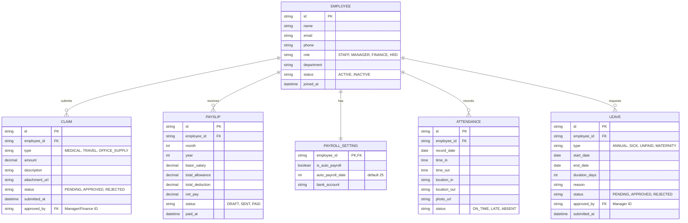

# HRIS Backend System Design & API Contract

Dokumen ini merangkum desain arsitektur basis data (*Database Schema / Entity Relationship Diagram*) dan ekspektasi struktur API untuk mendukung antarmuka Frontend.

## 1. Entity Relationship Diagram (ERD)
Diagram di bawah memodelkan relasi data utama untuk fungsionalitas Karyawan (*Employees*), Klaim (*Reimbursement*), dan Penggajian (*Payroll*).

## 2. API Endpoints Recommendations

Berikut adalah daftar kebutuhan (*contract*) API yang harus disediakan oleh *Backend Developer*:

### A. Authentication (`/api/v1/auth`)
- `POST /login` : Autentikasi pengguna menggunakan *email* dan *password*. Mengembalikan token (seperti JWT) dan informasi dasar pengguna (*role*, *name*).
- `POST /logout` : (Opsional) Melakukan invalidasi sesi token pada sisi server.
- `GET /me` : Mengambil profil/informasi pengguna yang sedang aktif berdasarkan token pada *header* permintaan.

### B. Employees (`/api/v1/employees`)
- `GET /` : Mengambil daftar karyawan (Mendukung query `?page=1&limit=10&search=Budi&status=ACTIVE`).
- `GET /:id` : Mengambil detail karyawan spesifik.
- `POST /` : Menambahkan karyawan baru (Single).
- `POST /bulk-import` : Mengunggah file CSV/Excel untuk *import* massal. Menerima form-data `file`.
- `PATCH /:id/status` : Menonaktifkan (*Deactivate*) atau mengaktifkan karyawan.

### B. Claims & Reimbursement (`/api/v1/claims`)
- `GET /` : Mengambil daftar klaim. 
  - Jika yang memanggil berstatus *STAFF*, hanya kembalikan klaim miliknya.
  - Jika berstatus *FINANCE/MANAGER*, kembalikan semua klaim (Mendukung filter tahun: `?year=2025`).
- `POST /` : Pengajuan klaim baru. Menerima form-data/JSON dengan lampiran (*attachment*).
- `GET /stats` : (Khusus Manager) Mengambil total agregasi klaim per tahun dan *breakdown* per bulan untuk digambar dalam bentuk grafik.
- `PATCH /:id/approve` : (Khusus Manager) Mengubah status klaim menjadi *APPROVED* atau *REJECTED*.

### C. Payslips (`/api/v1/payslips`)
- `GET /` : Mengambil riwayat slip gaji. Mendukung filter `?year=2025&month=08` (Maks 5 tahun terakhir).
- `POST /bulk-import` : (Khusus Finance/HRD) Mengunggah CSV/Excel detail gaji karyawan per bulan.
- `POST /:id/send` : (Khusus Finance/HRD) Mengirim/memproses *payroll* secara manual untuk satu karyawan.
- `POST /send-bulk` : (Khusus Finance/HRD) Menjalankan proses gaji secara massal.

### D. Payroll Settings (`/api/v1/payroll-settings`)
- `PATCH /:employeeId` : (Khusus HRD/Finance) Mengatur apakah gaji karyawan akan ditransfer secara otomatis (*Automate Payroll*) dan pada tanggal berapa (*default* 25).

### E. Attendance (`/api/v1/attendance`)
- `GET /` : Mengambil log kehadiran.
  - *STAFF*: Hanya log kehadiran diri sendiri.
  - *MANAGER/HRD*: Seluruh log karyawan (Mendukung filter tanggal, nama, status).
- `POST /clock-in` : Melakukan *clock-in*. Membutuhkan *payload* koordinat lokasi (Lat, Lng) dan bukti foto (*Selfie*).
- `POST /clock-out` : Melakukan *clock-out*. Membutuhkan *payload* koordinat lokasi.
- `GET /stats` : (Khusus Manager/HRD) Mengambil ringkasan jumlah hadir, terlambat, dan absen hari ini.

### F. Leaves / Time Off (`/api/v1/leaves`)
- `GET /` : Mengambil daftar pengajuan cuti.
  - *STAFF*: Hanya melihat daftar pengajuan cuti miliknya (Mendukung filter bulan).
  - *MANAGER*: Mengambil cuti miliknya dan cuti milik staf bawahannya untuk di-*approve*.
  - *HRD*: Mengambil semua data cuti di perusahaan (*God-mode*).
- `POST /` : Mengajukan cuti baru.
- `PATCH /:id/approve` : (Khusus Manager) Menyetujui atau menolak (*Approve/Reject*) cuti bawahan.
- `GET /balance` : Mengambil sisa saldo cuti (*Annual Balance*) tahun berjalan.
